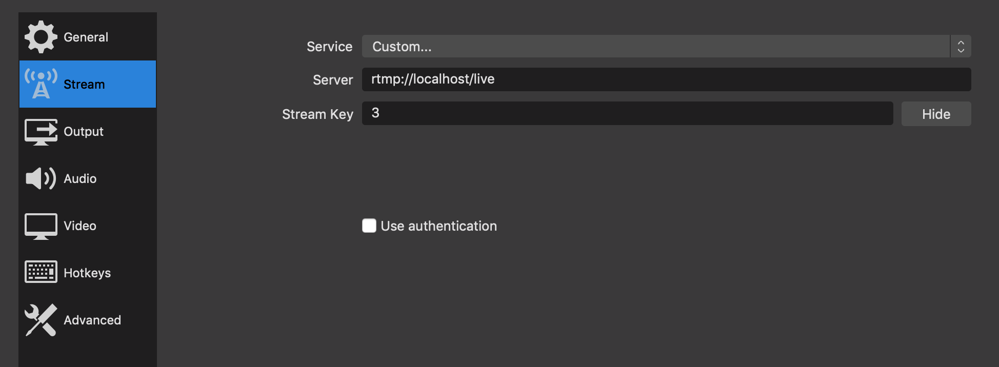

# SIMPLE BROADCAST STREAM CRUD
 
cd  into folder rtmpserver `npm init` when completed run `npm run start`\
cd  into folder server `npm init` when completed run `npm run start`\
cd  into folder  client `npm init` when completed run `npm run start`

create new stream channel `http://localhost:8000/streams/new`

## Folder: rtmserver 
The rtmserver is responsible for the connection OBS and the browser

## Folder: server 
used json server to presits data to json file 

## Folder: client 
Create, Read, Update and delete new streams with oauth

# Broadcast stream from desktop
download https://obsproject.com/

Settings OBS

add new scence give it a name for example Streaming Scene\
add new sources for example Audio Input Capture, adn Display Capture\

Prefrences > Stream > server `rtmp://localhost/live`\
stream key = new stream channel id: 3

stream key is the id for a stream created once a user creates a new stream
you can find the id's inside `./server/db.json`

